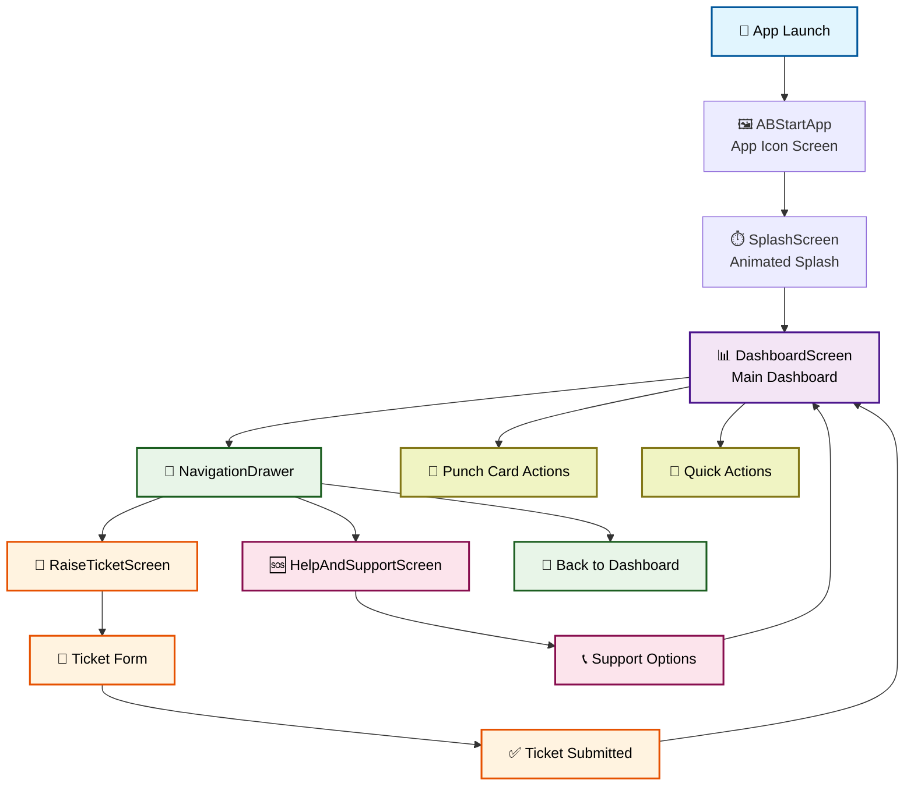
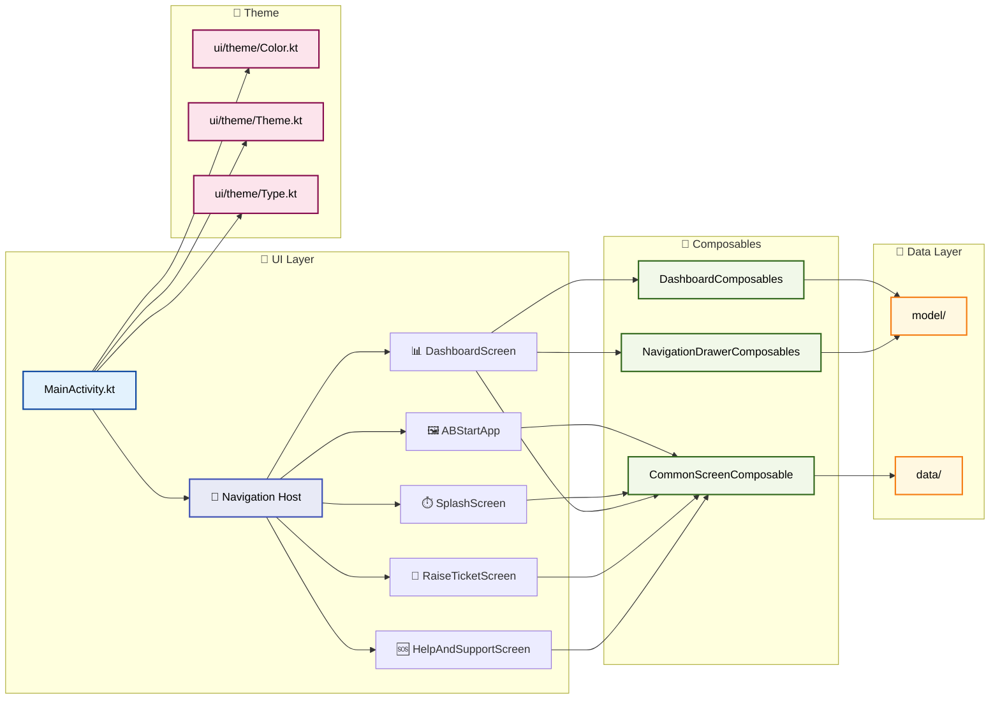
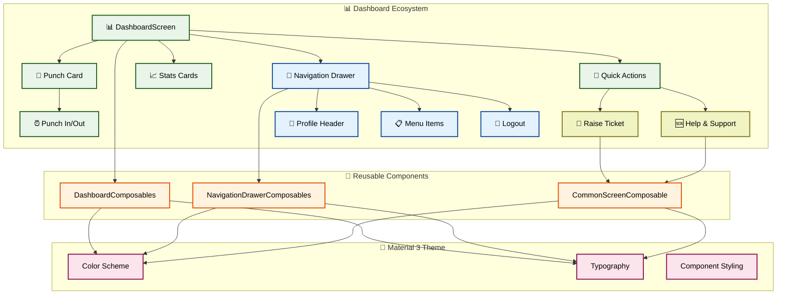
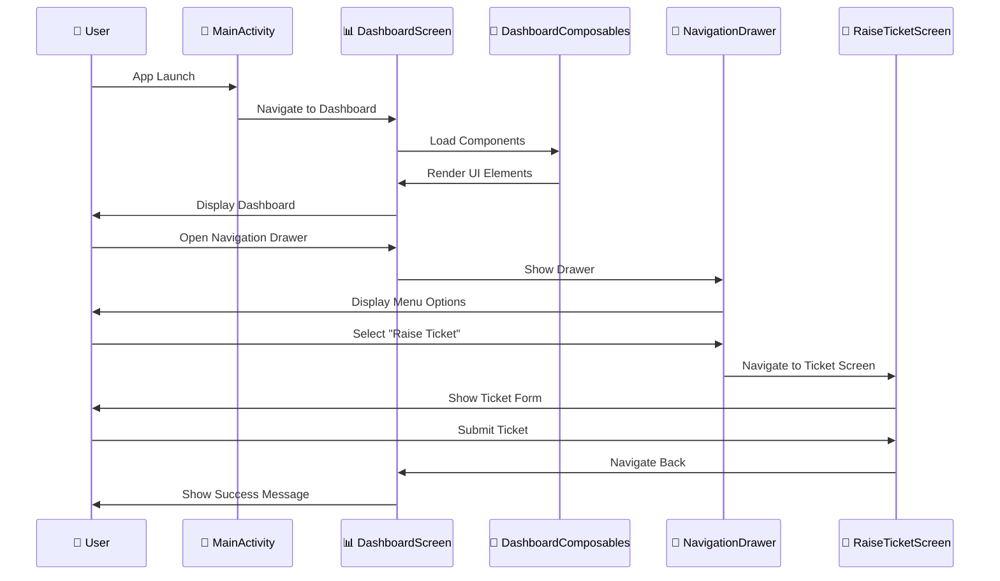

# 🚀 Internship1Project – IDMS InfoTech

👋 Hi, I'm **Kaustubh Deshpande**  
This is my internship assignment submission for **IDMS InfoTech**. It’s a UI/UX-focused Android app developed using **Jetpack Compose** and **Material 3**. The project showcases my skills in layout structure, responsive design, and interface customization.

---

## ✨ Screens & Enhancements

### 🖼️ 1. App Icon Screen
- ❌ **Issue**: The existing screen follows phone’s theme inconsistently.
- ✅ **Improved**: Consistently uses a **light theme** regardless of system settings.

---

### ⏱️ 2. Splash Screen
- ❌ **Issue**: Trademark appears after text.
- ✅ **Improved**: Trademark is **static** while text **animates and fades out smoothly**.

---

### 📊 3. Dashboard Screen
- ✅ Revamped the **Support button**.
- ✅ Ensured the **Punch-out card is scrollable** for better UX.

---

### 📂 4. Navigation Drawer
- ✅ Enhanced UI for a cleaner, more **Material 3** feel.
- ✅ Top (header/logout) remains **static**, lower items are **scrollable**.

---

## 📁 Project Structure

```
Internship1Project/
├── 📄 README.md                    # Project documentation
├── ⚙️ build.gradle.kts             # Root build configuration
├── ⚙️ settings.gradle.kts          # Gradle settings
├── 📝 gradle.properties            # Gradle properties
├── 🔧 gradlew & gradlew.bat        # Gradle wrapper scripts
├── 🔐 local.properties             # Local SDK paths
│
├── 📂 app/
│   ├── 📄 build.gradle.kts         # App-level build config
│   ├── 🛡️ proguard-rules.pro       # ProGuard rules
│   │
│   └── 📂 src/
│       ├── 📂 main/
│       │   ├── 📄 AndroidManifest.xml
│       │   ├── 🖼️ ic_launcher-playstore.png
│       │   │
│       │   ├── 📂 java/com/example/internship1project/
│       │   │   ├── 📱 MainActivity.kt           # Entry point & Navigation
│       │   │   │
│       │   │   ├── 📂 screens/
│       │   │   │   ├── 🖼️ ABStartApp.kt         # App Icon Screen
│       │   │   │   ├── ⏱️ SplashScreen.kt       # Animated Splash
│       │   │   │   ├── 📊 DashboardScreen.kt    # Main Dashboard
│       │   │   │   ├── 🎫 RaiseTicketScreen.kt  # Ticket Creation
│       │   │   │   ├── 🆘 HelpAndSupportScreen.kt # Support Page
│       │   │   │   ├── 📂 dashboard/           # Dashboard components
│       │   │   │   ├── 📂 drawer/              # Drawer components
│       │   │   │   └── 📂 nestedscreens/       # Nested screen views
│       │   │   │
│       │   │   ├── 📂 composables/
│       │   │   │   ├── 🧩 CommonScreenComposable.kt    # Shared UI components
│       │   │   │   ├── 📊 DashboardComposables.kt      # Dashboard-specific UI
│       │   │   │   └── 📂 NavigationDrawerComposables.kt # Drawer UI components
│       │   │   │
│       │   │   ├── 📂 data/                    # Data layer
│       │   │   ├── 📂 model/                   # Data models
│       │   │   └── 📂 ui/theme/                # Material 3 theming
│       │   │       ├── Color.kt
│       │   │       ├── Theme.kt
│       │   │       └── Type.kt
│       │   │
│       │   └── 📂 res/
│       │       ├── 🖼️ drawable/          # Icons, vectors, images
│       │       ├── 🎨 values/            # Colors, strings, dimensions
│       │       │   ├── colors.xml
│       │       │   ├── strings.xml       # 70% localization-ready
│       │       │   └── themes.xml
│       │       └── 📱 mipmap/            # App launcher icons
│       │
│       ├── 📂 test/                     # Unit tests
│       └── 📂 androidTest/              # Instrumentation tests
│
└── 📂 gradle/
    ├── 📄 libs.versions.toml           # Version catalog
    └── 📂 wrapper/                     # Gradle wrapper files
```

### 🏗️ Key Components

| Component | Description |
|-----------|-------------|
| 📱 **MainActivity** | Entry point with Jetpack Navigation setup |
| 🖼️ **ABStartApp** | Light theme consistent app icon display |
| ⏱️ **SplashScreen** | Animated splash with static trademark |
| 📊 **DashboardScreen** | Main dashboard with scrollable punch-out card |
| 📂 **NavigationDrawer** | Material 3 drawer with static header |
| 🧩 **Composables** | Reusable UI components for screens |
| 🎨 **ui/theme/** | Color scheme, typography, and Material 3 theming |
| 📂 **data/** | Data layer and business logic |
| 📂 **model/** | Data models and entities |

### 🛠️ Technology Stack

- **🏗️ Framework**: Jetpack Compose
- **🎨 Design System**: Material 3
- **🧭 Navigation**: Jetpack Navigation Compose
- **📱 Min SDK**: API 24 (Android 7.0)
- **🎯 Target SDK**: API 34 (Android 14+)
- **🔧 Build Tool**: Gradle with Kotlin DSL
- **⚡ Language**: Kotlin 100%

---

## 🔄 Project Flow & Architecture

### 📊 Navigation Flow


### 🏗️ Component Architecture


### 📱 Screen Component Relationships


### 🔄 Data Flow & State Management


---

## 💡 What's More?

> "This is my first time building a multi-screen, component-rich app using Compose. It challenged me to think in terms of structure, state, and visual clarity—something I truly enjoyed and plan to keep improving!"

---

## 🔗 Project & Resource Links

| Type               | Link                                                                                           |
|--------------------|------------------------------------------------------------------------------------------------|
| 📁 GitHub Repo     | [Internship1Project](https://github.com/deshkaustubh/Internship1Project)                       |
| 📄 Assignment Doc  | [Google Doc](https://docs.google.com/document/d/1VyhMWtHfzEkkQpxr-y6jGBDuCH7aY4LABI6Nh_lODCI)  |
| 📱 APK Download    | [Google Drive](https://drive.google.com/drive/folders/13WECiLo_CL5bj3i5aNohm5lRE-4npkZ5?usp=sharing) |
| 🎥 Demo Video      | [Watch on YouTube](https://youtu.be/VCCrv0ZHp7w)                                               |

---

## 🙋‍♂️ About Me

- 📄 **Portfolio**: [Kaustubh Deshpande](https://kaustubhdeshpande.netlify.app/)
- 🧑‍💼 **LinkedIn**: [Kaustubh Deshpande](https://www.linkedin.com/in/deshkaustubh/)
- 💻 **GitHub**: [@DeshKaustubh](https://github.com/deshkaustubh)
- 📧 **Email**: contact.DeshKaustubh@gmail.com

---

## 📌 Assignment Summary [Given Tasks]

- ✅ UI/UX focused – No backend logic required.
- 🎯 Goals: Layout, navigation, and clean composable structure.
- 📆 Deadline: **15th June, 2025 (Sunday)**
- 🧪 Evaluation: Based on responsiveness, visual accuracy & code structure.
- 🧩 Resembles a real-world **HRMS project** you'd build during the internship.

---

> ⭐ _Thank you for taking the time to review this project. Open to feedback and collaboration!_
